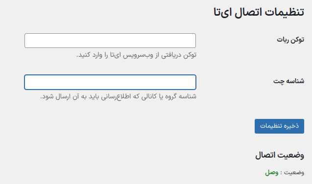

# اعلان سفارشات ووکامرس در ای‌تا (WooCommerce → Eitaa Notifications)

این افزونه رویداد «در حال انجام» سفارش‌های ووکامرس را به بات/کانال شما در ای‌تا می‌فرستد و امکان ارسال دستی هر سفارش را نیز در پنل مدیریت فراهم می‌کند. هدف اصلی افزونه، اطلاع‌رسانی سریع تیم پشتیبانی از وضعیت سفارش‌ها بدون نیاز به ورود به وردپرس است.



## امکانات کلیدی
- ارسال خودکار سفارش به محض ورود وضعیت به `processing` از طریق `woocommerce_order_status_processing`.
- دکمه `ارسال به ای‌تا` در صفحه جزئیات سفارش برای ارسال دستی یا مجدد.
- نمایش وضعیت اتصال در نوار ابزار مدیریت همراه با پیام خطا در صورت عدم اتصال.
- ذخیره امن `API Token` و `Chat ID` در پایگاه داده با رمزگذاری Base64 و پاک‌سازی خودکار کش وضعیت هنگام تغییر مقادیر.
- قالب پیام شامل اطلاعات گیرنده، اقلام سفارش، آدرس، روش ارسال و مبالغ به همراه تاریخ جلالی (وابسته به `Morilog\Jalali\Jalalian`).

## پیش‌نیازها
- WordPress 5.8 یا جدیدتر.
- WooCommerce 7.0 یا جدیدتر.
- PHP 7.4 به بالا (سازگار با PHP 8).
- فعال بودن کلاس `Morilog\Jalali\Jalalian` برای تبدیل تاریخ‌ها (در صورت نیاز، آن را از طریق composer یا افزونه مستقل بارگذاری کنید).
- دسترسی به حساب توسعه‌دهندگان ای‌تا در [Eitaayar.ir](https://eitaayar.ir/) برای ایجاد توکن API و دریافت شناسه چت.

## نصب
1. آخرین نسخه افزونه را دانلود و پوشه `wp-eitaa` را به مسیر `wp-content/plugins/` منتقل کنید یا فایل zip را مستقیماً از بخش «افزودن افزونه» در وردپرس آپلود کنید.
2. در منوی «افزونه‌ها» افزونه «پلاگین اشتراک سفارشات ووکامرس در ایتا» را فعال کنید.

## پیکربندی
1. در پنل مدیریت وردپرس به مسیر `داشبورد → ایتــا` بروید.
2. `API Token` دریافتی از `eitaayar.ir` را در فیلد «توکن ربات» وارد کنید.
3. `Chat ID` گروه یا کانالی که قرار است پیام دریافت کند را در فیلد «شناسه چت» ثبت کنید.
4. تنظیمات را ذخیره کنید تا کش وضعیت پاک و ارتباط مجدداً بررسی شود.
5. وضعیت اتصال در همین صفحه و در نوار ابزار مدیریت بالای سایت قابل مشاهده است.

### آزمون ارسال پیام
- یک سفارش آزمایشی ایجاد کنید و وضعیت آن را به «در حال انجام» (`processing`) تغییر دهید تا پیام به‌صورت خودکار ارسال شود.
- برای ارسال دستی یا ارسال مجدد، در صفحه جزئیات همان سفارش روی دکمه «ارسال به ای‌تا» کلیک کنید. نتیجه درخواست در یک پیام هشدار نمایش داده می‌شود.

### نکات رفع اشکال
- در صورت دریافت پیام «اطلاعات اتصال به ای‌تا تنظیم نشده است.» مطمئن شوید توکن و شناسه چت خالی یا نامعتبر نباشد.
- اگر پیام دریافت نمی‌شود، وضعیت اتصال در نوار ابزار را بررسی کنید. توضیح خطا در همانجا نمایش داده می‌شود.
- کش وضعیت برای ۵ دقیقه نگه‌داری می‌شود. برای بررسی فوری، مقدار توکن یا شناسه چت را دوباره ذخیره کنید تا کش پاک شود.
- آیکون‌های روش‌های ارسال را می‌توانید در فایل `class/EitaaAPI.php` و آرایه `$shipping_icons` سفارشی کنید.

## ساختار درخواست API
تمام فراخوانی‌ها بر پایه الگوی زیر انجام می‌شود:

```
https://eitaayar.ir/api/API_TOKEN/METHOD_NAME
```

ارسال سفارش از طریق متد `sendMessage` صورت می‌گیرد. افزونه تمام پارامترهای لازم (`chat_id`, `title`, `text`) را به صورت `HTTP GET` به سرویس ارسال می‌کند.

## تغییرات نسخه‌ها
- 2025-10-21 · v2.0.0 · افزودن صفحه تنظیمات جدید، وضعیت اتصال در نوار ابزار و دکمه ارسال سریع از صفحه سفارش.
- 2024-12-03 · v1.0.0 · اصلاح نمایش تاریخ سفارش و تبدیل صحیح به تقویم شمسی.
- 2023-07-05 · v1.0.0 · انتشار اولیه افزونه.

## مجوز
این افزونه تحت مجوز GPL نسخه 2 یا جدیدتر منتشر شده است. متن کامل مجوز در فایل `LICENSE` موجود است.

## English At A Glance
WooCommerce orders are pushed to the Eitaa messenger as soon as they reach the `processing` status. You can configure the bot token and chat id under `Dashboard → Eitaa`, monitor the connection from the admin toolbar, and manually resend any order directly from the order details screen.
